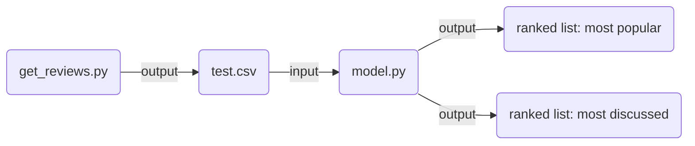

# MovieRekomendr :movie_camera:
Chirag Gupta `@chiragg4` | Shreyah Prasad `@sprasa20` | Aliva Panigrahi `@alivabp2`
## Overview
MovieRekomendr is a personable movie recomender system based on popular [Letterboxd](https://letterboxd.com/) user reviews. Letterboxd is a social film review website, where users can come together to rank movies and leave short or detailed reviews. Using sentiment analysis on the site's most recent reviews, MovieRekomendr provides users with best and worst ranked lists of the best films that have been reviewed on LetterBoxd. 

## Work Distribution
Shreyah investigated the site structure for Letterboxd and used BeautifulSoup4 to develop a scraper that pulls reviews from the site in an organized manner, while only saving relevant information for our model and excluding any unnecessary data,
Chirag and Aliva developed the model, trained it with different datasets, and experimented with different classifiers using NLTK and Sci-Kit Learn. 

## Tools & Technologies
To implement MovieRekomendr, we made use of various libraries. We primarily used [Beautiful Soup](https://www.crummy.com/software/BeautifulSoup/), a Python library for pulling data from HTML files. This provided us with a bank of text movie reviews and numerical ratings. To conduct sentiment analysis on the text reviews we used [NLTK](https://www.nltk.org/), a Python suite of libraries to assist in NLP. The NLTK movie review corpus was a useful addition for our implementation. Last but not least, we used [Scikit-Learn](https://scikit-learn.org/stable/) to test different classifiers, including linear support vector machine and random forest. We are also using a bank of [iMDB](https://www.imdb.com/) (a similar film review site) reviews to further train the model.

## Code Design
Our code is divided into two main Python files: </br>
`get_reviews.py`: scrapes all movie reviews and rankings and outputs as a `.csv` </br>
`model.py`: trains model using most optimal classifier AND ranks movies based on sentiment analysis </br>


## Work Distribution
Shreya developed the web scraper using BeautifulSoup to pull all relevant reviews from Letterboxd.
Chirag and Aliva primarily developed the model, experimented with various classifiers, and trained the models with different datasets using NLTK and SciKit-Learn.  

## Code Installation & Instructions
2. Ensure that you have the latest version of Python3. We specifically used Python 3.11.0
2. Clone/download this repository, and ensure you have successfully downloaded the following files: </br>
    `get_reviews.py` </br>
    `model.py` </br>
    `finalized_model.sav` </br>
3. Ensure that you have downloaded all dependencies: </br>
   BeautifulSoup: `pip install beautifulsoup4` </br>
   NLTK: `pip install --user -U nltk` </br>
   SciKit-Learn: `pip install -U scikit-learn` </br>
   Pickle: `pip install pickle` </br>
4. If you want to scrape the reviews yourself, simply run `python3 get_reviews.py`. This will save results in the file `test.csv`. The output file is also already saved in this repository, so this is not required unless you want to run the scraper yourself. If you would like to skip running the scraper, just make sure to download `test.csv`.
5. Next, you have two options in running `model.py`. If you want to train the model (**Disclaimer:** The training process takes a long time as it is being ran on a very large dataset to ensure uttmost accuracy.) </br>
    A. If you want to train the model, simply run: `python3 model.py`. </br>
    B. If you do not want to run the model again, please adjust the following line of code (93) in `model.py` from: </br>
```python
model_Path = None
model_Path = 'finalized_model.sav'
```
The code will then use the already trained model that we have provided, to generate the ranked list. With either option, you will be presented with two ranked lists, when the code finishes running.
   
